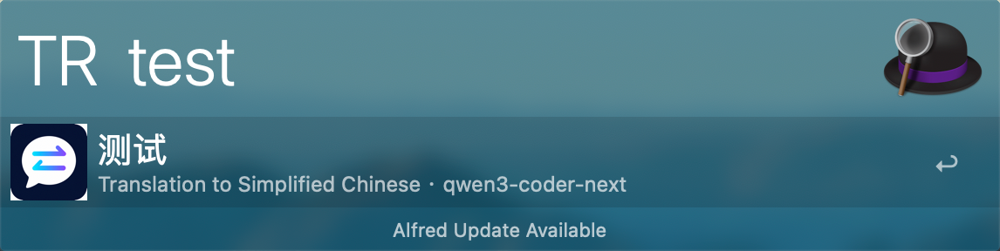
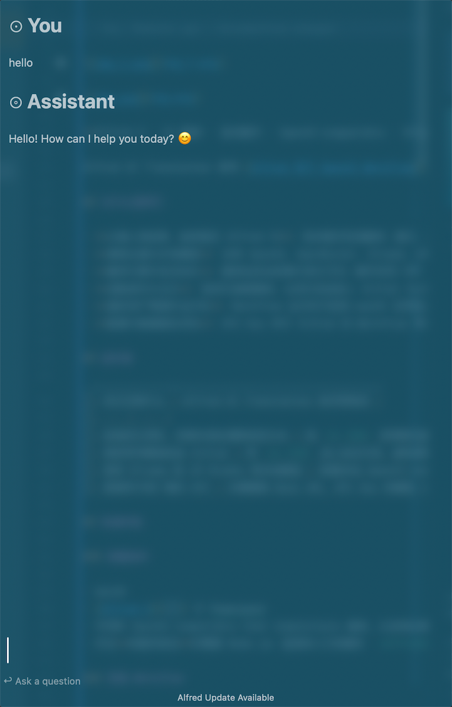
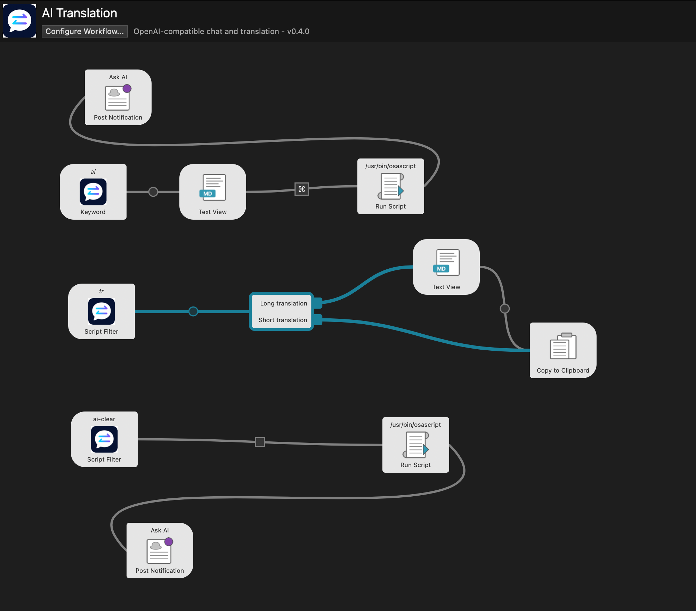

# Alfred AI Companion

> ? Alfred 5 Powerpack ??? OpenAI-compatible AI ??????? Workflow?? OpenAI?OpenRouter?Ollama?LM Studio ??????????????????????????




**Alfred 5 ? AI ?? ? ???? ? OpenAI-compatible ? Ollama ? LM Studio ? ???? ? macOS ????**

Alfred AI Translation ?? [Alfred ?? OpenAI Workflow](https://github.com/alfredapp/openai-workflow) ????????????????? AI ????????? Workflow ??????????????????? OpenAI-compatible Chat Completions API????????????????????

## ??????

- **??????????? Alfred ?**?????????????????????????????????????
- **?????????**??? OpenAI?OpenRouter?Ollama?LM Studio ????? `/v1/chat/completions` ????
- **?????????**?????????????????? SSE ???????????????????
- **???????**???????????????? Alfred Text View??????????
- **??????????**?Workflow ?????? macOS ??????? `curl`?????? Node.js?Python?Homebrew ? jq?
- **?????????**?API Key ?? Alfred ? Workflow ??????????????????????????????

## ???

| ?????? | Alfred AI Translation ????? |
| --- | --- |
| ?????????????????? | ? `tr ??` ?????????????????? |
| ???????? Alfred | ? `ai ??` ??????????????? |
| ?? Ollama ? LM Studio ????? | ???? OpenAI-compatible ??????????????????? |
| ???????? API | ???? Base URL?API Key ??? ID???? Workflow |

## ????

### ????

- macOS
- [Alfred 5](https://www.alfredapp.com/) ? Powerpack
- ??? OpenAI-compatible Chat Completions ????????? ID
- ??**?????**??? Node.js????????? `.alfredworkflow` ??? Node.js

### ?? Workflow

???????????????????

```bash
make package
```

????? `dist/AlfredAICompanion.alfredworkflow`?? Alfred ?????

### ??????

1. ? Alfred ???????? Workflow ?????
2. ?? `OPENAI_BASE_URL`?`CHAT_MODEL` ? `TRANSLATION_MODEL`???????????? `OPENAI_API_KEY`?
3. ?? Alfred??? `tr hello world` ? `ai ????????` ?????

> ?????????? `OPENAI_API_KEY` ???????? API Key ????????????????

## ????

### `tr`??? AI ??

?? `tr ??` ????????????

- ????????????????????????????
- ??? 240 ???????? 3 ??????????? `?` ???
- ??????????? `?` ?? Text View ??????? `?` ???
- ???????????????????URL ??????

### `ai`??? AI ??

?? `ai ??` ? Alfred Text View ??????????

- SSE ???????????????????
- ??????? Alfred Workflow ??????? `MAX_CONTEXT_MESSAGES` ????????
- ? Ask AI Text View ?? `??` ??????????????????
- ?? `ai-clear`??????????????????????????????????

## ?????

???? OpenAI-compatible `POST /v1/chat/completions` ?????????????

| ?? | `OPENAI_BASE_URL` ?? | `OPENAI_API_KEY` |
| --- | --- | --- |
| OpenAI | `https://api.openai.com/v1` | ?? |
| OpenRouter | `https://openrouter.ai/api/v1` | ?? |
| Ollama | `http://127.0.0.1:11434/v1` | ???? |
| LM Studio | `http://127.0.0.1:1234/v1` | ???? |

> ??????????? `/chat/completions` ????????? Chat Completions ??????????? `/v1/models`???????? ID?

## ????

| ??? | ?? | ??? | ?? |
| --- | --- | --- | --- |
| `OPENAI_BASE_URL` | ? | `https://api.openai.com/v1` | OpenAI-compatible Base URL ??? Chat Completions ?? |
| `OPENAI_API_KEY` | ? | ? | ?????????? |
| `CHAT_MODEL` | ? | ? | ??????? ID |
| `TRANSLATION_MODEL` | ? | ? | ??????? ID |
| `CHAT_KEYWORD` | ? | `ai` | ??????? |
| `TRANSLATION_KEYWORD` | ? | `tr` | ??????? |
| `CHAT_SYSTEM_PROMPT` | ? | ? | ????????????? |
| `CHINESE_TARGET_LANGUAGE` | ? | `English` | ????????? |
| `OTHER_TARGET_LANGUAGE` | ? | `Simplified Chinese` | ?????????? |
| `MAX_CONTEXT_MESSAGES` | ? | `20` | ????????????????? |
| `REQUEST_TIMEOUT_SECONDS` | ? | `30` | ?????????????? |

## ?????

- API Key ????? Alfred Workflow ??????????????????????????
- ?????????? Alfred Workflow ??????????????
- ??????????????????????????????????????????
- ? API Key ??Workflow ???? `Authorization` ???????????????

## ?????

?????? Node.js????????

```bash
# ???????
make test

# ?? Workflow ??
make build

# ?????? Alfred ???
make package

# ????? Workflow ???????
make verify
```

?????

```text
src/
??? chat/          # ????????????
??? core/          # Alfred ???SSE ?????
??? openai/        # OpenAI-compatible ????
??? runtime/       # JXA?Foundation ??? curl ??
??? translation/   # ?????????????
workflow/          # Alfred Workflow ???????????
scripts/           # ??????????
tests/             # ???????
```

## ??

???? Issue ? Pull Request?????

- ?? OpenAI-compatible ????????
- Alfred ??????????
- ??????????????????
- ????????????

?????? `make test` ? `make verify`?????? API Key????????????????

## ???

??????????????????????????? `LICENSE`?????????????????





